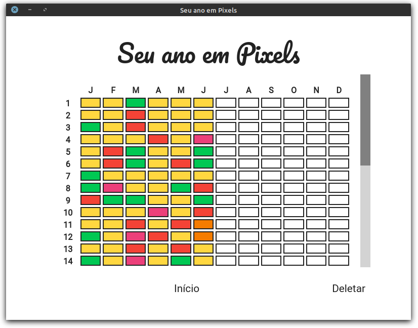

<h1 align="center">
    
</h1>

<h2 align="center">
    
</h2>

<h3 align="center">
    Year-In-Pixels
</h3>

<p align="center">O seu humor no ano colorido como Pixels.</p>

<p align="center">
  

  <a href="https://www.linkedin.com/in/edujso/">
    
  </a>
  
  
  
  <a href="https://github.com/EduardoJM/year-in-pixel/commits/master">
    
  </a>
  
  <a href="https://github.com/EduardoJM/year-in-pixel/issues">
    
  </a>
  
  
</p>

<p align="center">
  <a href="#sobre-o-projeto">Sobre o projeto</a>&nbsp;&nbsp;&nbsp;|&nbsp;&nbsp;&nbsp;
  <a href="#tecnologias">Tecnologias</a>&nbsp;&nbsp;&nbsp;|&nbsp;&nbsp;&nbsp;
  <a href="#executando">Executando</a>&nbsp;&nbsp;&nbsp;|&nbsp;&nbsp;&nbsp;
  <a href="#contribuindo">Contribuindo</a>&nbsp;&nbsp;&nbsp;|&nbsp;&nbsp;&nbsp;
  <a href="#licença">Licença</a>
</p>

## Sobre o projeto

Projeto de software criado, baseado em alguns templates, para permitir a coloração de cada dia de um ano com cores baseadas no seu humor em cada dia.

## Tecnologias

O projeto foi criado utilizando as seguintes tecnologias:

- JavaScript (VanillaJS)
- [Electron](https://www.electronjs.org/)
- [vanilla-picker](https://vanilla-picker.js.org/)

Dependências de desenvolvimento:

- [Commitizen](https://github.com/commitizen/cz-cli)
- [Commitlint](https://github.com/conventional-changelog/commitlint)
- [ESLint](https://eslint.org/)
- [Husky](https://github.com/typicode/husky)
- [Lint-Staged](https://github.com/okonet/lint-staged)

## Executando

Você pode executar o projeto seguindo os passos:

### 1 - Clone o repositório

```bash
git clone https://github.com/EduardoJM/year-in-pixel.git
```

### 2 - Instale as dependências

```bash
cd year-in-pixel
npm install
```

### 3 - Execute

```bash
npm start
```

## Contribuindo

Contribua fazendo um *fork* do repositório, fazendo suas contribuições e abrindo um *pull request*.

## Licença

Projeto publicado sobre a licença *MIT*. Veja o arquivo `LICENSE`.
