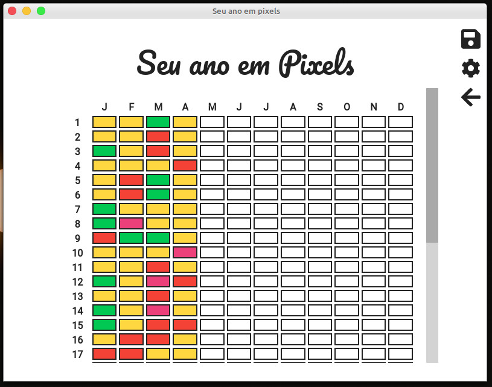
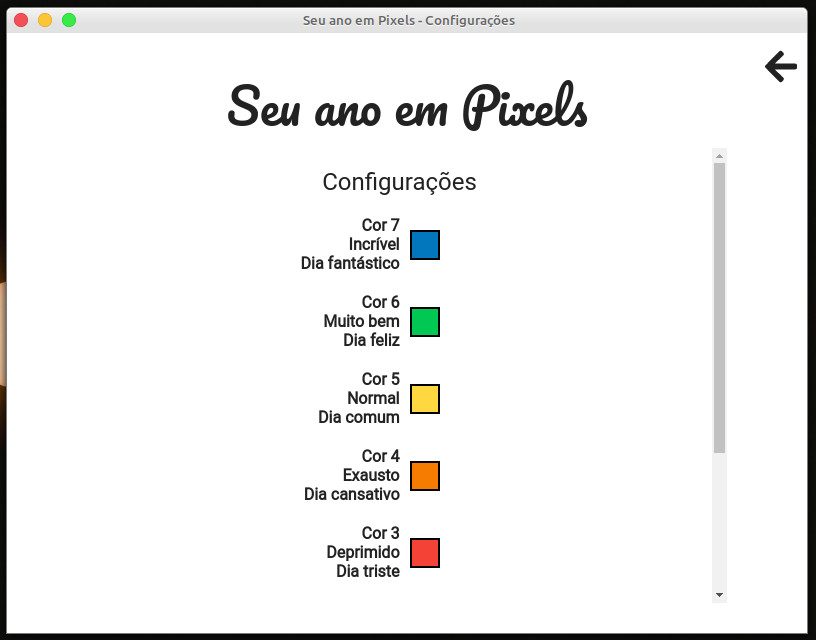
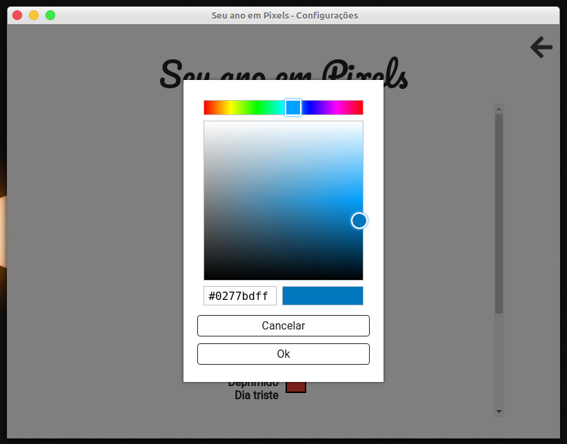

# Year-In-Pixels

## Introdution

The **year-in-pixel** is an small software created by me, Eduardo Oliveira, using JavaScript with electron to registry the mood in all days of the years.

**Observation:** the strings inside the application is in portuguese (from brazil) because this is my native language.



All the colors in the application are customizable inside the app, in configuration page, see the images:





## Technologies

The application is build using the tools:
- **JavaScript** as language with **Electron** to build desktop apps with JavaScript.
- **Sqlite** to storage the data.
- **ESLint** to JavaScript code style.
- **Commit-Lint**, **Commitizen** and **Husky** for the consistance of commit messages.
- **SASS** for styling.

The text editor used is **VSCode**.

### Small ESLint Work-around

The ESLint presents an error in `no-octal-escape`, then a work-around for this bug is found [here](https://stackoverflow.com/a/59429588), is to replace the
```javascript
/^(?:[^\\]|\\.)*?\\([0-3][0-7]{1,2}|[4-7][0-7]|0(?=[89])|[1-7])/su
```
with
```javascript
/^(?:[^\\]|\\.)*?\\([0-3][0-7]{1,2}|[4-7][0-7]|[1-7])/u
```

## Scripts

The `package.json` has some scripts:
- **sass** is used to run sass file watcher.
- **start** run electron development app.
- **electron-rebuild-sqlite** rebuild sqlite, required in some times when the sqlite is not working correctly in project (rare situations).
- **postinstall**, **pack** and **dist** are commands to electron-builder.